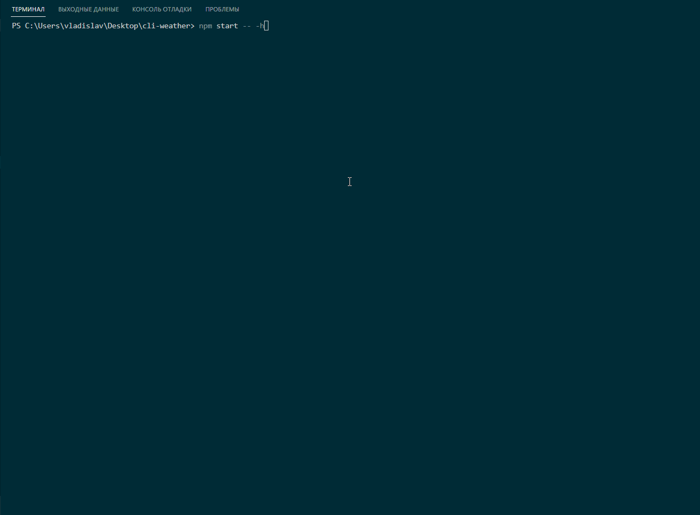

# cli-weather
CLI проект - выводит текущую погоду вашего города 

## Команды

|                        |                       |
|------------------------|:----------------------|
| Установить зависимости | `npm i`               |
| Помощь                 | `npm -h`              |
| Установить токен       | `npm -t [API_KEY]`   |
| Установить город       | `npm -s [belgorod]`   |
| Запустить              | `npm start`           |

<div align="left">



#
## Проект сожержит

<details>
  <summary>NODE JS</summary>
 
  [Что это?](https://nodejs.org/)  

   Node или Node.js — программная платформа, основанная на движке V8 (компилирующем JavaScript в машинный код), превращающая JavaScript из узкоспециализированного языка в язык общего назначения. Node.js добавляет возможность JavaScript взаимодействовать с устройствами ввода-вывода через свой API, написанный на C++, подключать другие внешние библиотеки, написанные на разных языках, обеспечивая вызовы к ним из JavaScript-кода.
</details>

# 
## Для запуска потребуется
- этот репозиторий 
 ```
  https://registry.npmjs.org/cli-global-weather
```
- node.js 
 
```
https://nodejs.org/en/
```

- терминал 

#
## Связвться со мной
<div align='center'> 
 
 ```
vladislavbobyrev@yandex.ru
```
 
 [](https://t.me/VladislavBobyrev)

 </div>
 
<div align="center">
  <h2>**ВНИМАНИЕ!**  Вся конфигурация является открытой. </h2>

</div>
